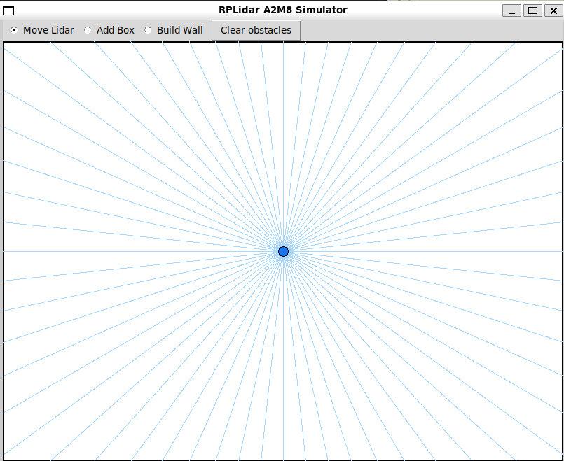
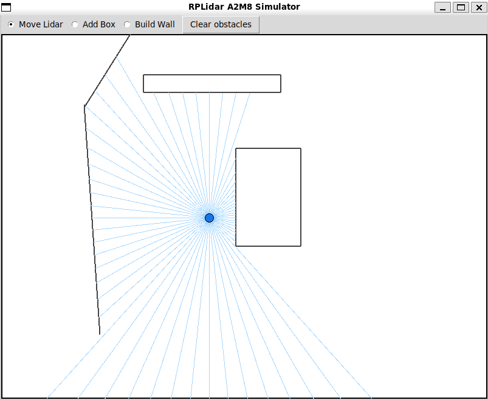
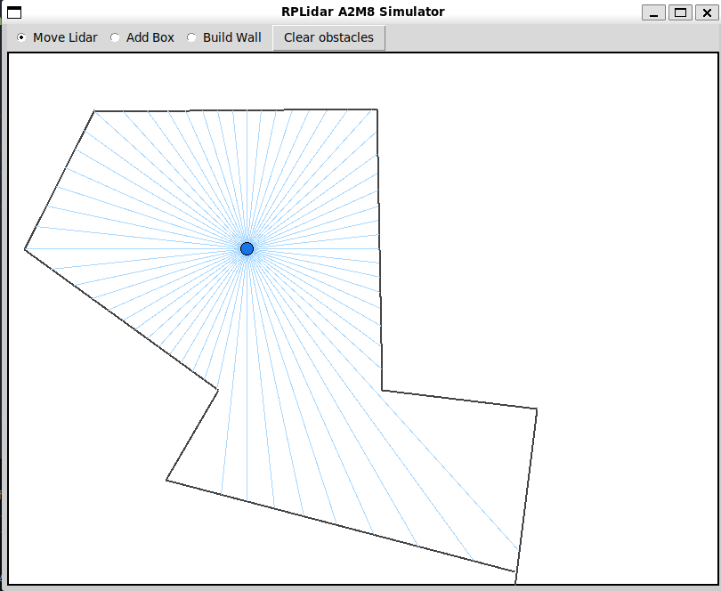

# lidar-sim

A 2D RPLidar A2M8 simulator with a live, paint-as-you-go world editor. Streams realistic 360-degree scans over TCP so you can develop and debug lidar-based algorithms without owning the hardware.

## Why I built it

I was working on a scan-matching algorithm (scan_cox) for my robotics class and didn't have a lidar yet. Replaying the same recorded `.bag` file over and over wasn't cutting it — every tweak to the algorithm wanted a fresh scan against a slightly different scene, and I couldn't get one. So instead of waiting on hardware, I wrote this: an editable 2D arena that ray-casts a 360-degree scan and ships it out in the same wire format an A2M8 driver expects. Point your algorithm at `127.0.0.1` and it doesn't know the difference.

## What it does

- 800x600 px arena (8 m x 6 m at 10 mm/px) with a movable lidar.
- Live editor: drag the lidar around, paint rectangular boxes, draw line walls, clear the scene.
- 360 samples/scan at 1-degree resolution, ~1.8 Hz, with a Gaussian noise model and a 6-bit quality byte.
- TCP control + data sockets that mimic the RPLidar A2M8 binary protocol.


*Default scene: lidar in an empty 8x6 m arena, every 6th ray drawn for clarity.*


*Boxes mode: rectangular obstacles painted into the scene get raycast in real time.*


*Walls mode: free-hand line segments — useful for hallway / loop-closure SLAM tests.*

## Run it

Requires Python 3.12+ and Tkinter (bundled with most Python distributions).

```
python main.py
```

That opens the GUI and starts the control listener on `127.0.0.1:9887`. When a client sends `START`, the simulator connects out to `127.0.0.1:9888` and streams scans there until it receives `STOP`.

## Use it from your code

1. Launch `main.py`.
2. Edit the scene in the GUI to whatever test case you want.
3. From your algorithm: listen on the data port, then send `START` to the control port.

```python
import socket

data = socket.socket(); data.bind(("127.0.0.1", 9888)); data.listen(1)
ctrl = socket.socket(); ctrl.connect(("127.0.0.1", 9887)); ctrl.send(bytes([0x10, 0x00]))
stream, _ = data.accept()
# ...read 5-byte header + payload, decode samples, feed to your algorithm
```

For the full picture see the docs.

## Docs

- [docs/scans.md](docs/scans.md) — what a single reading contains: fields, units, ranges, noise/quality model, how to assemble a full 360-degree scan.
- [docs/protocol.md](docs/protocol.md) — the wire format: TCP ports, frame header, sample bitfields, decode formulas.
- [docs/integration.md](docs/integration.md) — plugging the simulator into a SLAM / scan-matching pipeline, with a complete reference client.
